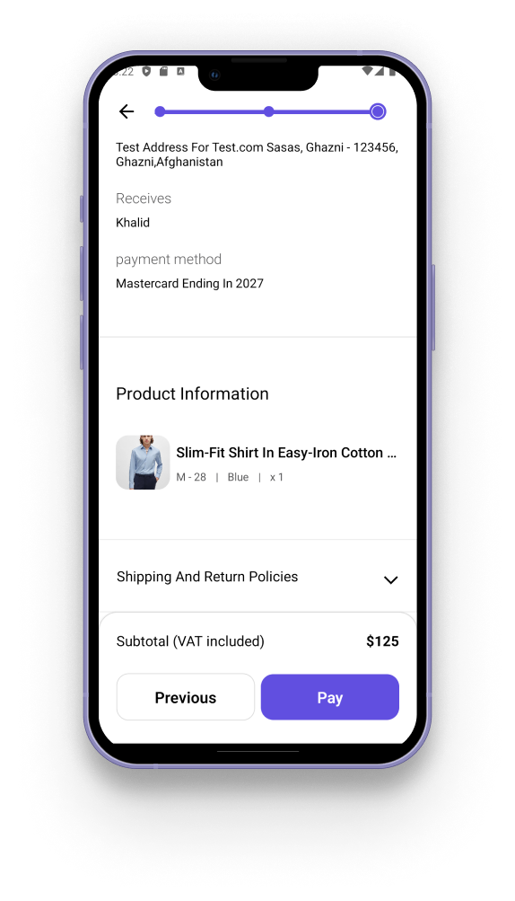

---

# Stylish Clothing Store App

This application is a full-featured clothing store built with a modern and stylish design using React Native. As a complete full-stack application, it provides a seamless shopping experience on mobile, allowing users to browse, search, and purchase the latest fashion items. With an intuitive interface and smooth navigation, this app brings a high-end shopping experience directly to users' fingertips.

## Features

- **Modern UI**: Designed with user experience in mind, featuring clean lines and a contemporary style.
- **Product Browsing**: Explore a range of fashion items with detailed descriptions and high-quality images.
- **Dynamic Cart**: Easily add, remove, or adjust items in the cart, with real-time updates and accurate price calculations.
- **Order Management**: Easily Manage orders and cancel at any time. Track your orders and get full summary of the order. Place single or multiple product at a time.
- **Customizable Product Views - advance filters**: View options by category, size, color, and more for an easy shopping experience.

## Demo

<div  style="display: flex; flex-direction: 'row';">


</div>

## Screenshots

<div  style="display: flex; flex-direction: 'row';">





</div>

## Tech-Stack

- React-native (build with expo)
- Nativewind
- Nodejs
- Express
- MongoDB

## Prerequisites

- **Node.js**: Version 18 or higher - download Node.js from [nodejs.org](https://nodejs.org)
- **Android Studio**: For running the app on Android Emulator
- **Git**: for cloning the repository
- **Environment**: Use this link as reference for setting it up [Link](https://reactnative.dev/docs/set-up-your-environment)
- **MongoDB_uri**: You need MongoDB URI to connect with your MongoDB database. refer to [this](https://docs.mongodb.com/manual/reference/connection-string/)
- **Country_API**: You need Country API key to fetch country, state and city information. refer to [this](https://countrystatecity.in/)
- **Cloudinary**: You need Cloudinary API key to upload images. refer to [this](https://cloudinary.com/documentation/react_integration)

## Installation

1. **Clone the repository:**

   ```sh
   git clone https://github.com/MK884/stylish.git
   ```

2. **Install dependencies:**
   ```sh
   npm install
   ```

## Setting Up Environment Variables

1. **Create a Copy of `.env.example`:**

   ```bash
   cp server/.env.example server/.env
   cp client/.env.example client/.env
   ```

2. **Fill in the environment variables:**

   Open the newly created .env files in both the server and client folders and replace placeholder values like with your actual environment-specific values.

## Running the App

### For Android

1. **Start the Metro bundler:**

   ```sh
   npm run android
   ```

🎉🎉Congrats! You should now be able to see the app running on your Android emulator or connected device.

Note: Make sure you have Android Studio installed and have an emulator or connected device running Android 6.0 or higher.

## Credits & Disclaimer

This application uses images and references to real brands solely for educational purposes to showcase product listings in a realistic setting. All brand images and logos are the property of their respective owners. This app is not affiliated with or endorsed by any brand featured within. The images are used for non-commercial, demonstration purposes only.

## Design Inspiration

This app’s design was inspired by a
<a href="https://www.figma.com/@fabrizzio">Fabrizzio Moncada</a>, serving as a visual reference to create a modern and stylish user interface. Special thanks to the original designer for sparking ideas that helped shape the app's look and feel.

Figma => https://www.figma.com/community/file/961389527467372232/mobile-ecommerce-ui-kit
